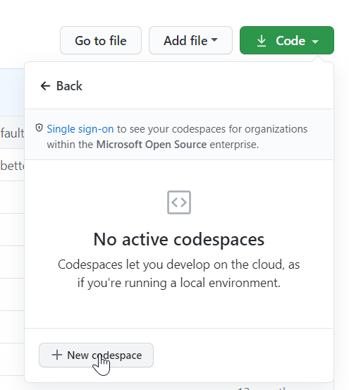
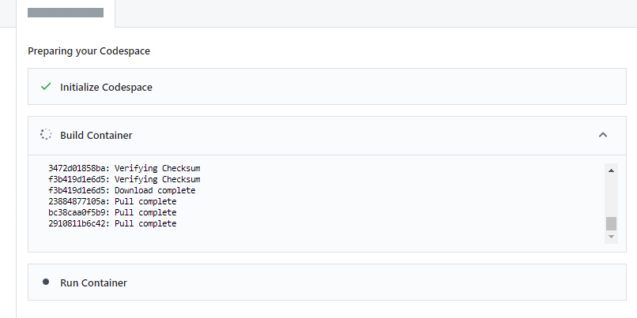
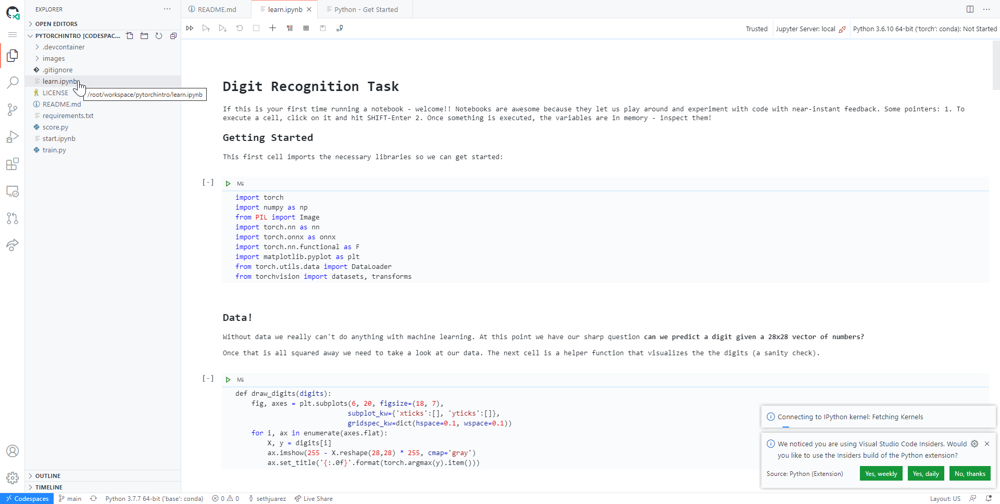
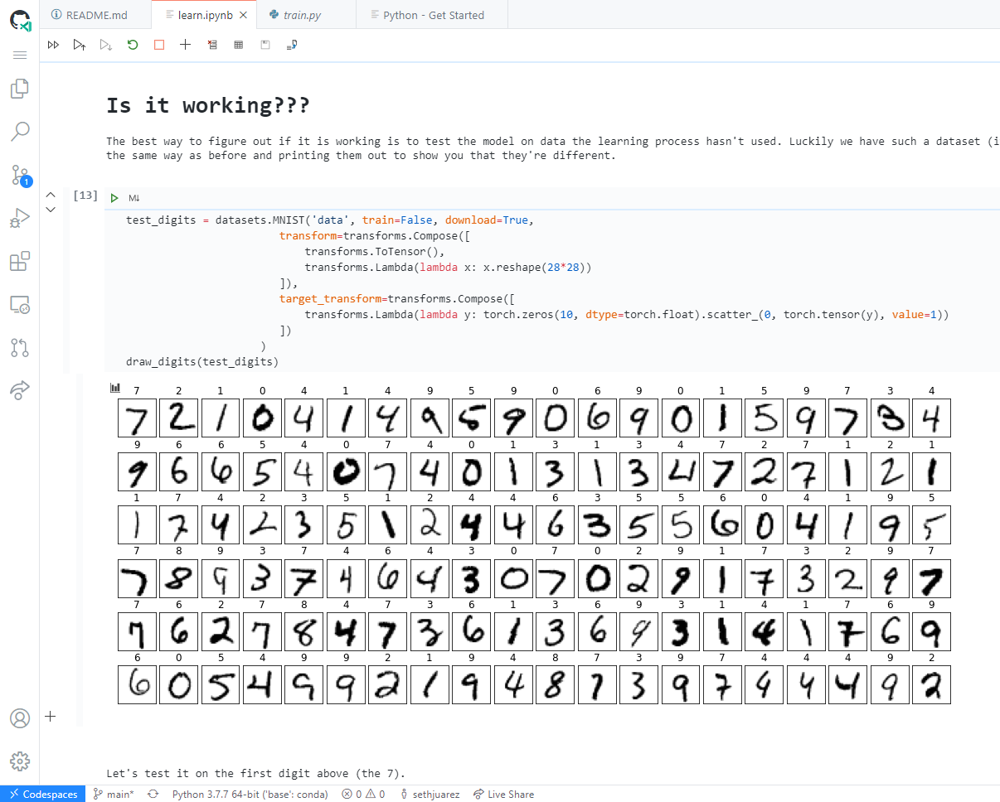

# TL;DR

Do this:
1. Clone this repo
2. Create new codespace

3. Wait for the codespace container to build (takes 5-6m)

4. Open [notebook](learn.ipynb)

5. Run all teh things! (Hit `SHIFT-ENTER` in all of the cells: I closed the file explorer to get more space too)

6. (Other things...)
7. Become a millionaire

(OPTIONAL)

8. Run the [training](train.py) and/or [scoring](score.py) script

Add an issue to the repo if something doesn't work so I can 
fix it!

# Machine Learning Quickstart
The purpose of this brief tutorial is to get you oriented
on the Machine Learning Process. Machine Learning (ML) is
basically a different way of creating "code" or something
that is executed much in the same way code is executed. The
primary difference is that machine learning has set classes
of execution paths (usually called models) that have fixed
parameters that need to be "learned." For supervised learning
these parameters are optimized by giving ML algorithms examples
of the inputs and answers. The process usually proceeds as follows:

1. Start with a question
2. Find relevant data
3. Select appropriate items from the data
4. Choose a model type
5. Optimize the model parameters
6. Save model
7. Put model into production

The notebooks presented in this repo are divided into two
overlpping sections:

- Problem, Data, Experimentation - Local
- Large Scale Experimentation, Deployment - Cloud

# Local
The [starting notebook](learn.ipynb) shows the local approach
to the Machine Learning Process. In this notebook you will
find the first 5 steps outlined above but on a smaller scale
(in this case the problem is small as is - generally for larger
problems we begin on a small scale and then once some of the
hypothesis are proved we move to large scale).

# Problem
Because I am more interested that you learn the process I decided
to go with the "Hello World" of Machine Learning: **predicting 
digits**.

Basically, given a 28x28 pixel grayscale image, can you predict
the actual handwritten number? Mathematically speaking, given 
a 784 sized vector of numbers between 0-255, can you return the 
corresponding digit?

# Questions and/or Suggestions
If there is any part of this that is hard to understand please
add an issue to the repo! Would love to make this super easy to
understand. My personal opinion is that everyone can understand
the rudiments of what is happening!

